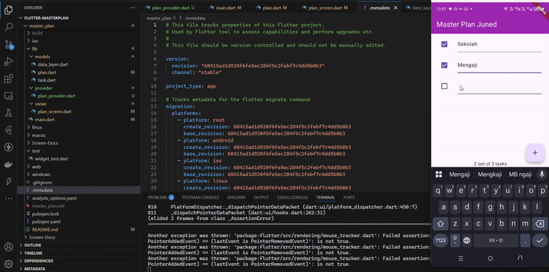
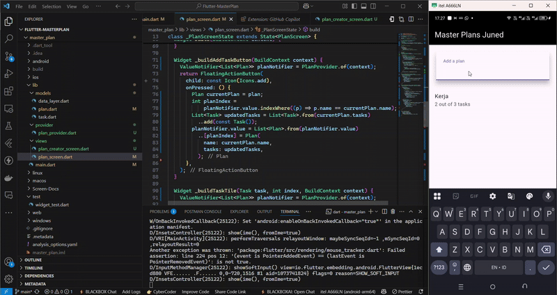

# master_plan

A new Flutter project.


## Screen Capture
### **GIF Praktikum 1**


### **GIF Praktikum 2**


### **GIF Praktikum 3**


## Soal Praktikum 1
1. Selesaikan langkah-langkah praktikum tersebut, lalu dokumentasikan berupa GIF hasil akhir praktikum beserta penjelasannya di file README.md! Jika Anda menemukan ada yang error atau tidak berjalan dengan baik, silahkan diperbaiki.
2. Jelaskan maksud dari langkah 4 pada praktikum tersebut! Mengapa dilakukan demikian?
3. Mengapa perlu variabel plan di langkah 6 pada praktikum tersebut? Mengapa dibuat konstanta ?
4. Lakukan capture hasil dari Langkah 9 berupa GIF, kemudian jelaskan apa yang telah Anda buat!
5. Apa kegunaan method pada Langkah 11 dan 13 dalam lifecyle state ?
Kumpulkan laporan praktikum Anda berupa document doc

### **Jawaban Praktikum 1**
1. Program telah berjalan sebagaimana mestinya
2. Dengan mengelompokkan beberapa model ke dalam satu file, kita dapat mengimpor semua model tersebut dengan satu baris kode. Ini mengurangi jumlah baris kode yang diperlukan untuk impor di setiap file yang membutuhkan model tersebut. Misalnya, alih-alih menulis:

    
    ```kotlin
        import 'package:master_plan/models/plan.dart';
        import 'package:master_plan/models/task.dart';
    ```
    Kita cukup menulis:

    ``` kotlin
        import 'package:master_plan/models/data_layer.dart';
    ```
    membuat kode lebih bersih dan lebih mudah dibaca, terutama saat aplikasi berkembang dan jumlah model bertambah.

3. Variabel plan di langkah 6 praktikum ini sangat penting karena berfungsi sebagai representasi dari rencana yang dikelola dalam aplikasi. Variabel ini menyimpan informasi tentang nama rencana dan daftar tugas, sehingga memudahkan pelacakan dan pengelolaan data. Dengan adanya plan, saya bisa mengakses dan memperbarui informasi dengan lebih efisien, serta memastikan tampilan aplikasi selalu mencerminkan data terbaru melalui pemanggilan setState().

    Selain itu, mengapa harus dibuat sebagai konstanta? agar nilai awalnya tidak akan berubah setelah diinisialisasi. Ini memberikan keamanan data dan menjaga konsistensi struktur rencana meskipun ada perubahan pada daftar tugas. Dengan menjadikannya sebagai konstanta, kode menjadi lebih mudah dibaca dan dipahami. Secara keseluruhan, variabel plan sangat penting untuk pengelolaan data dalam aplikasi, dan menjadikannya sebagai konstanta adalah praktik yang baik dalam pengembangan perangkat lunak.

4. Setelah menambahkan widget _buildTaskTile, aplikasi akan menampilkan daftar tugas dengan checkbox dan field untuk mengedit deskripsi. Pengguna dapat mencentang atau menghapus centang pada checkbox untuk menandai tugas sebagai selesai atau belum selesai, serta dapat mengedit deskripsi tugas sesuai kebutuhan.
    

5. **Langkah 11** : Pada langkah ini, menambahkan method initState() setelah deklarasi variabel scrollController. Method ini dipanggil ketika objek state dari widget diinisialisasi. Di dalam initState(), menginisialisasi scrollController dan menambahkan listener. Listener ini berfungsi untuk menangani interaksi pengguna dengan scroll. Ketika pengguna menggulir, meminta fokus pada FocusNode baru, yang membantu dalam mengelola keyboard dan interaksi pengguna. Dengan cara ini, memastikan bahwa semua pengaturan yang diperlukan sudah siap sebelum widget ditampilkan.
    
    **Langkah 13** : Di langkah ini, menambahkan method dispose(), yang dipanggil ketika objek state dihapus dari pohon widget. Method ini digunakan untuk membersihkan sumber daya yang tidak lagi diperlukan. Dalam konteks ini, memanggil scrollController.dispose() di dalam dispose(). Ini penting untuk membebaskan sumber daya yang digunakan oleh ScrollController dan mencegah kebocoran memori. Dengan membersihkan sumber daya yang tidak lagi diperlukan, membantu menjaga performa aplikasi dan memastikan bahwa aplikasi berjalan dengan efisien.

6. Done

## Soal Praktikum 2
1. Selesaikan langkah-langkah praktikum tersebut, lalu dokumentasikan berupa GIF hasil akhir praktikum beserta penjelasannya di file README.md! Jika Anda menemukan ada yang error atau tidak berjalan dengan baik, silakan diperbaiki sesuai dengan tujuan aplikasi tersebut dibuat.
2. Jelaskan mana yang dimaksud InheritedWidget pada langkah 1 tersebut! Mengapa yang digunakan InheritedNotifier?
3. Jelaskan maksud dari method di langkah 3 pada praktikum tersebut! Mengapa dilakukan demikian?
4. Lakukan capture hasil dari Langkah 9 berupa GIF, kemudian jelaskan apa yang telah Anda buat!
5. Kumpulkan laporan praktikum Anda berupa doc !

### **Jawaban Praktikum 2**
1. Program telah berjalan sebagaimana mestinya
2. InheritedWidget merujuk pada InheritedNotifier<ValueNotifier<Plan>> yang digunakan dalam class PlanProvider. InheritedNotifier digunakan karena lebih efisien dalam memperbarui UI dibandingkan InheritedWidget biasa. Dengan menggunakan ValueNotifier, hanya widget yang tergantung pada data yang akan diperbarui saat terjadi perubahan, tanpa merender ulang seluruh widget tree. 
3. Method completedCount digunakan untuk menghitung jumlah tugas yang telah selesai, sedangkan completenessMessage digunakan untuk menampilkan pesan status penyelesaian tugas dalam format "<jumlah selesai> out of <total tugas> tasks".
Mengapa dilakukan demikian? Agar data dapat diakses dengan lebih mudah, meningkatkan efisiensi dengan menghindari pengulangan logika perhitungan di UI, serta memisahkan data dari tampilan sesuai dengan prinsip separation of concerns.
4. Pada langkah 9, widget SafeArea ditambahkan di dalam Column, yang berisi teks dari completenessMessage. SafeArea memastikan teks tersebut tidak tertutup oleh elemen sistem seperti notch atau navigation bar.
Dengan langkah ini, aplikasi menampilkan pesan jumlah tugas yang selesai dan total tugas yang ada di bagian bawah layar tanpa terhalang UI sistem. Selain itu, implementasi ini juga menunjukkan pemisahan yang baik antara model (Plan) dan view (UI) dalam pengelolaan state aplikasi. (Note: GIF terdapat pada Readme Github)
5. Done


